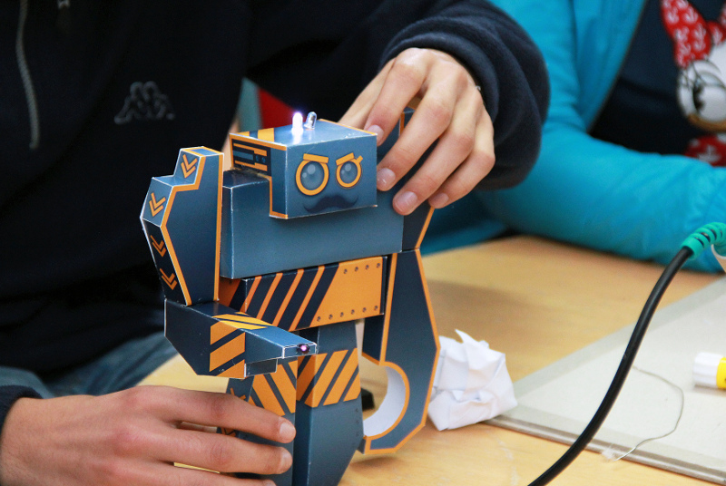

Electronic Paper Toys
============================

Electronic paper toys is an open source project developed by [Laboratório de Criação Digital](https://www.lcdporto.org). The goal of this project is to fuse electronics and paper for educational purposes.

## Want to contribute?

Want to contribute? Excellent! We are open to suggestions, collaborations and improvements. Get in touch or make a pull request!